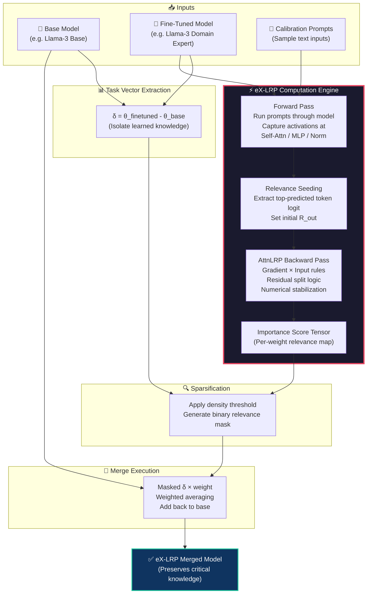

# eX-LRP

### eXplainable Layer-wise Relevance Propagation for Transformer Model Merging
**Intelligent, faithful weight preservation for merging Transformer LLMs with a single backward pass**

[](https://www.gnu.org/licenses/lgpl-3.0)
[](https://github.com/arcee-ai/mergekit/actions/workflows/pre-commit.yml)
[](https://github.com/arcee-ai/mergekit)
[](https://www.python.org/)
[](https://pytorch.org/)

---

## Table of Contents

- [What is eX-LRP?](#-what-is-ex-lrp)
- [How It Works](#-how-ex-lrp-works)
- [Supported Transformer Architectures](#-supported-transformer-architectures)
- [Getting Started](#-getting-started)
- [Quickstart](#-quickstart)
- [Architecture Diagram](#-architecture-diagram)
- [Merge Configuration](#-merge-configuration)
- [All Mergekit Methods](#-all-mergekit-merge-methods)
- [Running on Google Colab](#-running-on-google-colab)
- [Acknowledgements](#-acknowledgements)
- [Citation](#-citation)

---

## ✨ What is eX-LRP?

**eX-LRP** is an advanced model merging method built on top of [Mergekit](https://github.com/arcee-ai/mergekit) that uses **Explainable AI (XAI)** to intelligently preserve the most functionally critical weights when merging Transformer-based Large Language Models.

Unlike standard merging methods (linear averaging, TIES, DARE) that rely on magnitude or random pruning, eX-LRP uses **AttnLRP (Attention-Aware Layer-wise Relevance Propagation)** — a backpropagation-based technique — to precisely determine how much each individual weight in the Transformer contributes to the model's actual predictions.

### System Architecture 


### The Problem

| Standard Merging | eX-LRP Merging |
|:-:|:-:|
| Treats all weights equally or uses magnitude as a proxy | Scores every weight by its **true functional contribution** |
| Blindly averages or randomly prunes task vectors | Keeps only **XAI-verified critical weights** |
| Often causes "catastrophic forgetting" | **Preserves specialized knowledge** with mathematical guarantees |

### Why eX-LRP?

> *"Magnitude does not equal importance."*

A weight with a large magnitude might be irrelevant to the task, while a small weight deep in an Attention head might be the critical link that makes the model perform well. eX-LRP solves this by **tracing the prediction backward** through the entire Transformer graph — through Self-Attention, MLPs, LayerNorms, and Residual connections — to find the weights that truly matter.

---

## 🔬 How eX-LRP Works

eX-LRP implements a **Gradient × Input** formulation of Layer-wise Relevance Propagation, inspired by the [AttnLRP paper (ICML 2024)](https://proceedings.mlr.press/v235/achtibat24a.html). This enables faithful relevance attribution in a single backward pass through the entire Transformer.

### The Pipeline

```
1. TASK VECTOR EXTRACTION
   δ = θ_fine_tuned - θ_base
   (Isolate what the model learned)

2. FORWARD PASS WITH HOOKS
   Run calibration prompts → Capture activations at every
   Self-Attention, MLP, and LayerNorm block

3. RELEVANCE SEEDING
   Extract logits of the predicted token → Set initial R_out

4. AttnLRP BACKWARD PASS (The Core Innovation)
   Propagate relevance backward using PyTorch autograd:
   ┌─────────────────────────────────────────────────┐
   │  • Linear Layers:   Gradient × Input rule       │
   │  • LayerNorm/RMSNorm: Gradient × Input rule     │
   │  • Residual Connections: Proportional splitting  │
   │  • Non-linearities (SiLU/GELU): Autograd-based  │
   └─────────────────────────────────────────────────┘
   Output: Importance Score Tensor for every weight

5. SPARSIFICATION
   Apply density threshold → Generate binary relevance mask

6. MERGE
   Masked task vector × weight → Add back to base model
```

### Key Technical Features

| Feature | Description |
|---|---|
| 🧠 **AttnLRP Rules** | Uses `Gradient × Input` via PyTorch `autograd` for mathematically faithful relevance through any differentiable operation |
| 🔀 **Residual Split Logic** | Correctly divides relevance between skip-connections and Transformer blocks based on relative activation magnitudes |
| 📐 **Numerical Stabilization** | Epsilon-stabilized denominators prevent division-by-zero in deep networks |
| 🎯 **Prediction-Seeded** | Relevance starts from the model's actual top-predicted token, not arbitrary uniform initialization |
| ⚡ **Single Backward Pass** | Entire importance computation runs in one backward pass — no iterative probing |

---

## 🧩 Supported Transformer Architectures

eX-LRP is designed for **Transformer-based** language models. The current implementation targets decoder-only causal LMs, which represent the vast majority of models merged with `mergekit`.

| Architecture | Model Family | Status | Notes |
|---|---|:---:|---|
| 🦙 Decoder-Only | LLaMA 2 / 3, Mistral, TinyLlama | ✅ Full Support | Primary target. All layers fully traced. |
| 🤖 Decoder-Only | Qwen 2 / 2.5 | ✅ Full Support | Standard `self_attn` / `mlp` structure. |
| 🧠 Decoder-Only | GPT-NeoX, StableLM | ✅ Full Support | Compatible naming conventions. |
| 🔤 Encoder-Only | BERT, RoBERTa | ⚠️ Partial | Linear/Norm layers traced; residual heuristics may need tuning. |
| 🔁 Encoder-Decoder | T5, BART, FLAN | ❌ Not Yet | Cross-attention and dual-stack propagation not implemented. |
| 🧬 Mixture of Experts | Mixtral, DeepSeek-MoE | ❌ Not Yet | Expert routing logic not yet handled. |

> **Note:** For `mergekit`, ~95% of all merges are between models in the same decoder-only family (e.g., two LLaMA fine-tunes). eX-LRP is built precisely for this use case.

---

## 🛠️ Getting Started

### Installation

```sh
git clone https://github.com/Tusm11/mergekit.git
cd mergekit
git checkout feat/lrp-merge-v3

pip install -e .  # Install mergekit with eX-LRP support
```

**Requirements:** Python 3.10+, PyTorch 2.0+, Transformers 4.36+

### Pre-computing LRP Scores (Optional)

For maximum control, you can pre-compute relevance scores before merging:

```sh
python lrp_computer.py \
    your-model-path \
    ./lrp-scores-output \
    --rule epsilon \
    --device cuda \
    --prompts "The capital of France is" "Artificial intelligence can"
```

This generates a `lrp_scores.safetensors` file that can be passed to the merge configuration.

---

## 🚀 Quickstart

### 1. Create a Merge Configuration

```yaml
# examples/lrp.yml
merge_method: lrp
base_model: TinyLlama/TinyLlama-1.1B-Chat-v1.0
parameters:
  density: 0.7    # Keep top 70% most relevant weights
models:
  - model: your-finetuned-model-1
    parameters:
      weight: 1.0
      lrp_scores: "./path/to/scores-1.safetensors"
  - model: your-finetuned-model-2
    parameters:
      weight: 1.0
      lrp_scores: "./path/to/scores-2.safetensors"
dtype: float16
```

### 2. Run the Merge

```sh
mergekit-yaml examples/lrp.yml ./output-merged-model \
    --cuda \
    --copy-tokenizer \
    --allow-crimes
```

### 3. Use Your Merged Model

```python
from transformers import AutoModelForCausalLM, AutoTokenizer

model = AutoModelForCausalLM.from_pretrained("./output-merged-model")
tokenizer = AutoTokenizer.from_pretrained("./output-merged-model")

inputs = tokenizer("The future of AI is", return_tensors="pt")
outputs = model.generate(**inputs, max_new_tokens=50)
print(tokenizer.decode(outputs[0]))
```

---

## 📐 Architecture Diagram



---

## 🔧 Merge Configuration

### eX-LRP Parameters

| Parameter | Type | Default | Description |
|---|---|---|---|
| `density` | float (0-1) | `0.7` | Fraction of most-relevant weights to keep. Lower = more aggressive pruning. |
| `weight` | float | `1.0` | Per-model weight for weighted averaging of task vectors. |

### Example: Global-to-Local Transfer

This is the primary use case for eX-LRP — merging a base "global" model with a domain-specific "local" fine-tune:

```yaml
merge_method: lrp
base_model: TinyLlama/TinyLlama-1.1B-Chat-v1.0
parameters:
  density: 0.7
models:
  - model: ./models/tinyllama-domain-expert
    parameters:
      weight: 1.0
      lrp_scores: "./models/tinyllama-domain-expert/lrp_scores.safetensors"
dtype: float16
```

---

## 📋 All Mergekit Merge Methods

`mergekit` supports many merging algorithms. eX-LRP is the first to use **Explainable AI** for weight selection.

| Method (`value`) | Core Idea | # Models | Base | Key Use Case |
|:---|:---|:---:|:---:|:---|
| [**Linear** (`linear`)](docs/merge_methods.md#linear-linear) | Weighted average | ≥2 | - | Model soups |
| [**SLERP** (`slerp`)](docs/merge_methods.md#slerp-slerp) | Spherical interpolation | 2 | ✓ | Smooth transitions |
| [**Task Arithmetic** (`task_arithmetic`)](docs/merge_methods.md#task-arithmetic-task_arithmetic) | Linear task vectors | ≥2 | ✓ | Skill transfer |
| [**TIES** (`ties`)](docs/merge_methods.md#ties-merging-ties) | Sparsify + sign consensus | ≥2 | ✓ | Reduce interference |
| [**DARE** (`dare_linear`, `dare_ties`)](docs/merge_methods.md#dare-dare_linear-dare_ties) | Random pruning + rescale | ≥2 | ✓ | Robust retention |
| [**DELLA** (`della`)](docs/merge_methods.md#della-della-della_linear) | Magnitude-based pruning | ≥2 | ✓ | Adaptive pruning |
| **eX-LRP** (`lrp`) | **AttnLRP relevance propagation** | **≥2** | **✓** | **XAI-driven weight preservation** |
| [**Passthrough** (`passthrough`)](docs/merge_methods.md#passthrough-passthrough) | Direct copy | 1 | - | Layer surgery |

For the full list and detailed docs, see the [Merge Method Guide](docs/merge_methods.md).

---

## ☁️ Running on Google Colab

For users without a local GPU, eX-LRP can be run entirely on Google Colab's free tier.

| Feature | Your Laptop (CPU) | Google Colab (Free GPU) |
|---|---|---|
| Training Time (1 epoch) | 2-4 hours | 5-15 minutes |
| Model Size Supported | GPT-2 (124M) | TinyLlama (1.1B) |
| Batch Size | 1 | 4-8 |
| Max Sequence Length | 64-128 | 256-512 |

### Quick Steps

1. Upload your files to Google Drive
2. Open `LRP_Merge_Colab_Training.ipynb` in Colab
3. Enable **GPU Runtime** (Runtime → Change runtime type → GPU)
4. Run all cells

The notebook will automatically:
- Install dependencies
- Train Global and Local models
- Compute eX-LRP relevance scores
- Merge the models
- Evaluate results

**Total time: ~40-60 minutes**

For detailed Colab instructions, see the [Colab Guide](docs/colab_guide.md).

---

## 🙏 Acknowledgements

- **[Mergekit](https://github.com/arcee-ai/mergekit)** by Arcee AI — The foundational toolkit this method is built on.
- **[LRP-eXplains-Transformers (LXT)](https://github.com/rachtibat/LRP-eXplains-Transformers)** — The AttnLRP paper and codebase that inspired the Gradient × Input formulation used in eX-LRP.
- **[AttnLRP: Attention-Aware Layer-Wise Relevance Propagation for Transformers](https://proceedings.mlr.press/v235/achtibat24a.html)** (ICML 2024) — The foundational paper by Achtibat et al.

---

## 📄 Citation

If you use eX-LRP in your research, please cite both Mergekit and the AttnLRP paper:

```bibtex
@inproceedings{goddard-etal-2024-arcees,
    title = "Arcee{'}s {M}erge{K}it: A Toolkit for Merging Large Language Models",
    author = "Goddard, Charles and Siriwardhana, Shamane and Ehghaghi, Malikeh and Meyers, Luke and Karpukhin, Vladimir and Benedict, Brian and McQuade, Mark and Solawetz, Jacob",
    booktitle = "Proceedings of the 2024 Conference on Empirical Methods in Natural Language Processing: Industry Track",
    month = nov,
    year = "2024",
    publisher = "Association for Computational Linguistics",
    url = "https://aclanthology.org/2024.emnlp-industry.36",
    doi = "10.18653/v1/2024.emnlp-industry.36",
    pages = "477--485",
}

@InProceedings{pmlr-v235-achtibat24a,
    title = "{A}ttn{LRP}: Attention-Aware Layer-Wise Relevance Propagation for Transformers",
    author = "Achtibat, Reduan and Hatefi, Sayed Mohammad Vakilzadeh and Dreyer, Maximilian and Jain, Aakriti and Wiegand, Thomas and Lapuschkin, Sebastian and Samek, Wojciech",
    booktitle = "Proceedings of the 41st International Conference on Machine Learning",
    pages = "135--168",
    year = "2024",
    volume = "235",
    series = "Proceedings of Machine Learning Research",
    publisher = "PMLR",
}
```

---

## 📜 License

This project is licensed under the [LGPL-3.0 License](https://www.gnu.org/licenses/lgpl-3.0).
